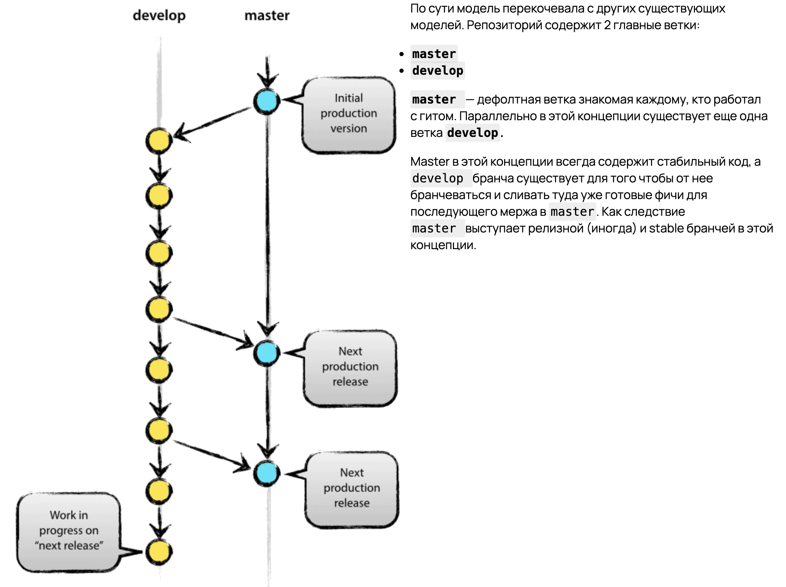

# ManiacGame

### Description 
2d игра про жертву, которая пытается спрятаться от маньяка. 

Игра будет делиться на несколько уровней.

Каждый уровень представляет собой квест, в котором необходимо прятаться от маньяка и решать головоломки. Конечная цель уровня: убить маньяка или убежать от маньяка.

### Documents
Ссылка на Miro с референсами и сюжетом: [тык](https://miro.com/welcome/R0RMbFF3N1dGRnVQdzQyUUoxUGlWeElINnVEa0xpWmdheWhJUkh2U3c0Vk1wTW5CcWY1TzhYM1hZYWc3R3pjZXwzMDc0NDU3MzYxMDQ5MjgwNDA1fDE=?share_link_id=519703877046)

Ссылка на обучение Unity: [тык](https://stepik.org/course/126291/syllabus)

Ссылка на обучение C#: [тык](https://www.sololearn.com/ru/learn/courses/c-sharp-intermediate)

### GitFlow

